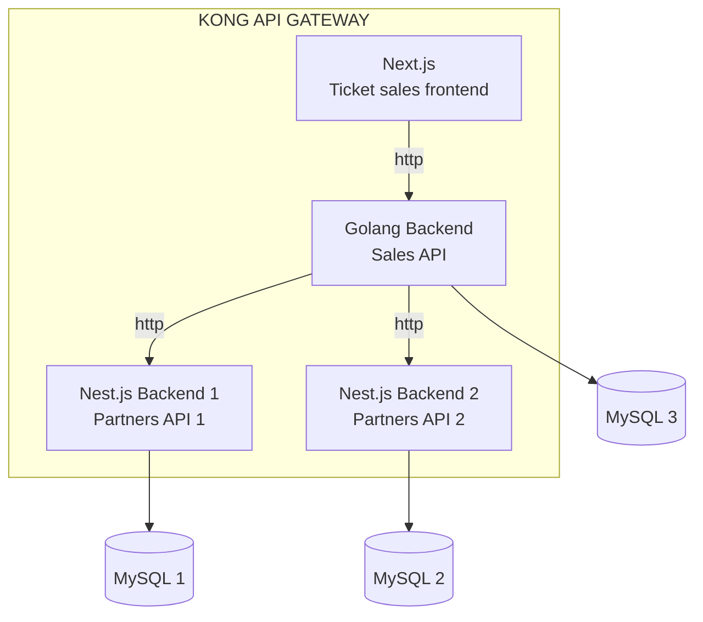
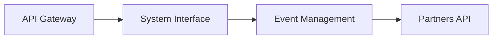
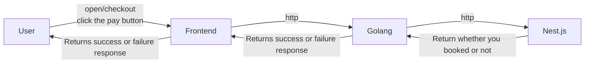

# Online ticket sales system

This project is a microservices-based system for selling tickets online. It allows ticket purchases through partner APIs, acting as intermediaries, and integrates the backend and frontend through an API gateway. We use robust technologies, widely adopted in large systems and organizations.

# Required Technologies

 - 
 - 
 - 
 - 
 - 

# Project overview

# Operating flow

# Project funcionalities

developing... 

## Credits

This project was created based on Full Cycle immersion

